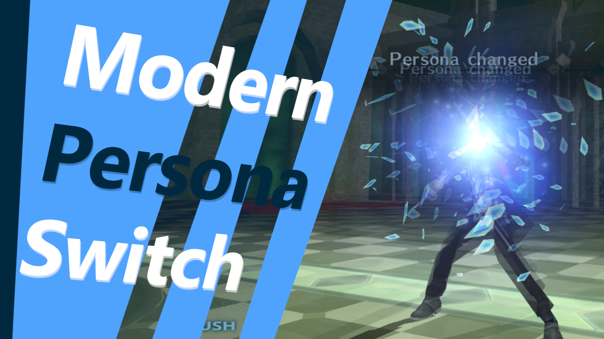

# Modern Persona Switch
## Description
This mod introduces a feature that allows you to switch personas infinitely during a single turn, as long as you don’t use any actions with the current persona. This mechanic mirrors the persona-switching system found in later titles of the Persona series, giving players the freedom to change strategies on the fly without being locked into a single persona choice per turn. Plan your tactics with more flexibility, change personas as many times as needed, and only commit to a persona when you're ready to execute an action!

## Compilation
This cheat is written in a custom language for PS2 cheats called CLPS2C, so the first step to compile this cheat is to use the [CLPS2C-Compiler](https://github.com/NiV-L-A/CLPS2C-Compiler/tree/master).

However, in the current version of the compiler (1.0.1 at the time of writing), a bug causes the cheat to compile incorrectly, resulting in a game crash during testing. To avoid this, you will need to use [alexankitty's](https://github.com/alexankitty) keystone pull request, which can be found [here](https://github.com/alexankitty/keystone). This ensures that the cheat compiles and runs correctly in the game.

## Acknowledgements
Special thanks to:

- [NiV-L-A](https://github.com/NiV-L-A) for creating the CLPS2C-Compiler.
- [alexankitty](https://github.com/alexankitty) for the keystone pull request that fixes the compilation bug.
- The Persona modding community for their continuous support and feedback.

Your contributions and support are greatly appreciated!